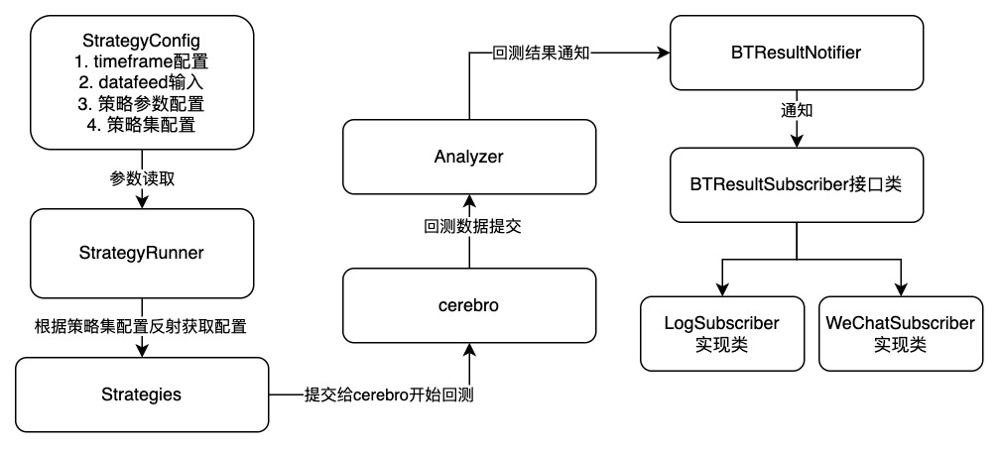

## 需求背景

使用backtrader进行量化策略回测已经有一段时间了，但是慢慢发现，原生框架只支持一个策略跑，而在思绪如同龙卷风一样自由的时候，我们总是想回头看看之前的策略跟`优化`后的策略性能对比。但是发现原始策略已经被改得面目全非，或者策略输出结果不能很好对比。

所以我想弄一个框架出来，能够将某个目录/文件中的策略批量进行回测运行，然后同步输出想要的结果。

## 需求分解

### 回测需求（一期）

* 支持特定文件中的策略批量运行（手动指定/反射获取）
* 定义统一的输入参数，且考虑参数可变，方便观察不同参数下的性能（可变参数要标记出来）
* 支持批量运行后的结果输出（图像/Analyzer）

### 模拟盘需求（二期）

* 指定策略使用模拟盘运行（单个/多个）

* 策略事件的通知机制
* 模拟盘运作报表
* 实时可视化视图

## 架构设计（一期）

### 架构概览

**简述**

​		一个批量回测的任务输入是`StrategyConfig`，包含任务所必须的timeframe、datafeed等输入，由`StrategyRunner`作为主类读取Config，来动态反射加载`Strategies`，然后提交到`backtrader`框架中去执行。

​		通常回测任务耗时很长，所以这里考虑回测任务无人值守，回测结果提交给`BTResultNotifier`后，由其统一通知给回测结果的订阅者类`BTRResultSubscriber`，这也为后续模拟盘/实盘运行提供了通知基础。

### 组件选型

* 依赖注入底座：dependency-injector
* 回测框架：backtrader
* 日志组件：loguru
* 可视化：prettytable
